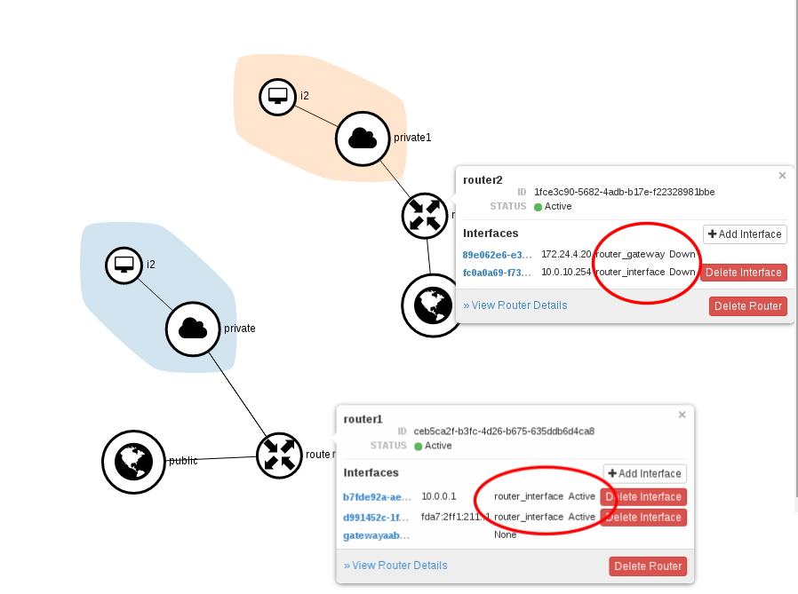
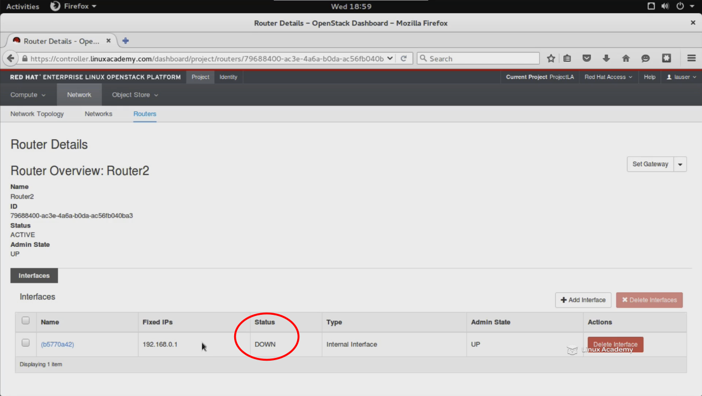

New router interfaces "DOWN"

Any new router I create has intrefaces "DOWN".
Here is the steps I am doing:

 1. Created a new private network "private1"  
 2. Created a new public
    network "public2" with different subnet pool
    (172.24.4.20,172.24.4.30) than the default one used
    (172.24.4.2,172.24.4.10), I changed the end range to 10 instead of254.      
 3. Created a new router "router2", connected to private network
        "private1" and set "public2" as default gateway.  
  
The issue is that the new router "router1" have all its interface statuses DOWN.  

  
  
When inspecting the namespaces, I can see both private networks  and the default router, but not the new router I created.  
  

    ip netns  
    qdhcp-76d4b3bc-8b95-4705-8552-811261ceb021 
    qrouter-ceb5ca2f-b3fc-4d26-b675-635ddb6d4ca8  
    qdhcp-7e17706c-9566-43e1-9d81-1cb9757d6e1c    

  
By the way I have noticed that it is the same the router created in Red Hat OpenStack Administrator Certification Prep Course  
  

Any hint about a possible cause?  

